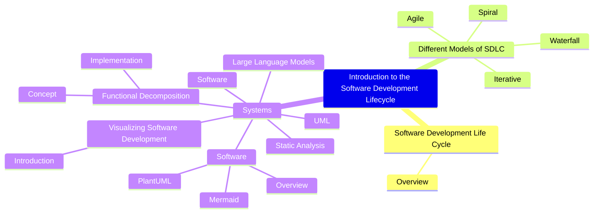
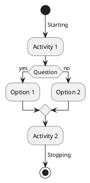

# Introduction to the Software Development Life Cycle
## Software Development Life Cycle

### Overview

The SDLC outlines the typical process in a software project, the basic structure [^1721106552] is  outlined below. Even though it may seem trivial it's worth reflecting on the steps to avoid making commitments that a developer will later regret. These commitments can often make it easier to discard an entire code base rather than unwind the development decisions, see e.g. [^1721106701].

[^1721106701]: [Abricotine is discontinued · Issue #347 · brrd/abricotine](https://github.com/brrd/abricotine/issues/347)


1. Identify the Problem
    - e.g. "I need to write a program that will calculate the area of a circle given the radius."
    - Ensure it's not an XY problem
        - e.g. "I need to write a program that will make it faster to manually transcribe invoices", in this case, maybe the invoices should be digitized instead.
2. Plan the Solution
    - Estimate the effort involved
    - Break the problem down into smaller problems
    - Prioritize the problems
    - Consider the 2 language problem
        - e.g. Write a MWE [^1721105971] as a CLI in Python or jump straight into the GUI in C++?
    - Create a todo list, e.g. `.org`, `todo.txt` Kanban board etc.
3. Implement
    - [ ] Create a notebook for logs, e.g. `.md`, `.org` etc.
    - [ ] Write the Documentation
    - [ ] Template the scaffolding, e.g. a CLI
    - [ ] Write the tests
    - [ ] Implement a dependency management system, e.g. Cargo, Poetry, `requirements.txt`
    - [ ] Write the code
4. Testing
    - Drive it, e.g. seek feedback from colleagues and a user and evaluate:
        - Reproducability -- does it build?
        - User Interface (e.g. CLI arguments or GUI keybindings)
        - User Experience (e.g. error messages)
    - This is more comprehensive than a mere test suite
5. Deployment
    - Cut a release, compile it and distribute it
        - The difficulty of this step leans heavily on the choices made in the previous steps
            - e.g. This is a lot easier:

                ```python
                pipx install git+https://github.com/user/cool_project.git
                ```
            - Than this:

                ```bash
                git clone https://github.com/user/cool_project.git
                cd cool_project
                check
                make
                sudo make install
                ```

                From here a user would be required to create a `.PKGBUILD` or atleast a container if they wanted to keep there system reproducable.

6. Maintenance
    - Keep the project up to date with changing dependencies
        - This is easier if the project is well documented and has a test suite
            - Easier still if dependency versions are pinned
    - Easier
## Different Models of SDLC

Even though the SDLC may seem linear, in practice it is often iterative and cyclical. The most common models are:

- Iterative
- Spiral
- Agile

These are described below.

### Iterative

The iterative process begins with a small subset of requirments and adds to those requirements as the project expands.

This is a simple approach but can lead to feature creep.

### Waterfall

In the waterfall model, the project is planned in phases that are completed in sequence. This is a more traditional approach to software development.

This can give a clear view of the project but can be difficult to change once the project is underway.

### Spiral

The spiral model is an iterative approach that uses the waterfall model within each iteration.

This can be a good way to get the best of both worlds but creates more management overhead.

### Agile

Agile is an iterative approach that breaks the project into phases that can be changed as the project develops.

This involves a lot of reflection and discussion to identify the direction the project should go.


[^1721105971]: Minimum Working Example
[^1721106552]: https://aws.amazon.com/what-is/sdlc/
## Systems
### Functional Decomposition
#### Concept


Many projects can be broken down into smaller modular components. Generally speaking, once a script gets longer than about 50 lines, this approach will make things a lot easier to manage.


```python
shape = "circle"
dim = 5

if shape == "circle":
    area = 3.14 * dim ** 2
elif shape == "square":
    area = dim ** 2
elif shape == "triangle":
    area = 0.5 * dim ** 2
elif shape == "triangle":
    area = 0.5 * dim ** 2
else:
    area = 0
```

It's very difficult to debug this code, and it's not very readable. It would be better to break it down into smaller components:

```python
def area_of_circle(radius):
    return 3.14 * radius ** 2

def area_of_square(side):
    return side ** 2

def area_of_triangle(base, height):
    return 0.5 * base * height

if __name__ == '__main__':
    print(f"Area of circle with radius 5: {area_of_circle(5)}")
```

This would allow us to test each component individually, include separate docstrings and re-use those functions later.

In some cases, it may be better to consider the problem in a more abstract way. For example, consider the following code:

```python
class Shape:
    def __init__(self):
        pass

    def area(self):
        raise NotImplementedError("Subclasses must implement this method")

    def perimeter(self):
        raise NotImplementedError("Subclasses must implement this method")


class Circle(Shape):
    def __init__(self, radius):
        self.radius = radius

    def area(self):
        return 3.14 * self.radius**2

    def perimeter(self):
        return 2 * 3.14 * self.radius


class Square(Shape):
    def __init__(self, side):
        self.side = side

    def area(self):
        return self.side**2

    def perimeter(self):
        return 4 * self.side


class Triangle(Shape):
    def __init__(self, base, height):
        self.base = base
        self.height = height

    def area(self):
        return 0.5 * self.base * self.height

    def perimeter(self):
        return self.base + self.height + (self.base**2 + self.height**2)**0.5

if __name__ == '__main__':
    circ = Circle(5)
    print(f"The area of a circle with radius = {circ.radius} circle is {circ.area()}")


```

In this example, each class can now be extended to include more features that are suitable for that shape **and** a parent class can serve as a template for the methods that are common to all shapes.

This is a more object-oriented approach to the problem.

#### Implementation

Consider the following series:

$$
Y \left(t\right) = \sum_{i = 1}^{n} \left[ \varepsilon_{\left[t-1\right]} \varepsilon_1 Y_{t-2} \theta_2 + Y_{\left[t-1\right]} \phi_1 + Y_{\left[t-2\right]} \right]
$$

In Python, we can plot numbers like so:

```python
import matplotlib.pyplot as plt
plt.plot([1, 2, 3, 4])
plt.show()
```

Produce the plot of that series using the following approaches:

    1. Procedurally
    2. Object Oriented
## Visualizing Software Development
### Introduction

Visual representations help understand and communicate design. In software design, we typically use the Unified Modeling Language (UML) to produce a set of diagrams [^1721351241]. UML is a standard method to visualize the structure of a codebase and the flow of information through that code base. UML diagrams are not universally loved, see e.g. [^1721123560] by the developer of Mermaid.js. However, it is useful to be able to put together a diagram when necessary and UML is a good starting point. The most common diagrams are class diagrams and sequence diagrams which will be demonstrated below, for a more comprehensive review, the reader is referred to the PlantUML and Mermaid docs.

### Software

#### Overview


The most common software for UML diagrams are:

- Mermaid
- PlantUML

Other software that can be used to produce visualizations of Software Development include:

- Graphs
    - Dot
    - Graphviz
- Diagrams
    - Mermaid
    - PlanTUML [^1721123699]
    - Tikz
        - PyTikz
    - Asymptote
    - Draw.io
- Logic
    - Schemdraw
- Gantt Charts
    - Taskjuggler

#### Mermaid
Mermaid is written in Javascript, as a result most markdown renderers will support it, including VSCode, Obsidian and even Markor on Android. It is a simple way to produce high diagrams in markdown. The syntax is simple and easy to learn, for example below is is this document as a mindmap. This could be produced in  plantuml [^1721123768] or mermaid [^1721123805]


    mindmap
    Introduction to the Software Development Lifecycle
        Software Development Life Cycle
            Overview
        Different Models of SDLC
            Iterative
            Waterfall
            Spiral
            Agile
        Systems
            Functional Decomposition
                Concept
                Implementation
            Visualizing Software Development
                Introduction
            Software
                Overview
                Mermaid
                PlantUML
            UML
            Software
            Static Analysis
            Large Language Models


#### PlantUML
##### Usage

Install plantuml from your package manager, e.g. on my system I use `podman` container with Arch:

```bash
distrobox enter arch
pacman -S plantuml
```

Then you write a file with the appropriate syntax, e.g. (reproduced from [^1721352360] )




```bash
set dir ~/Studies/Teaching/2024/uhe/it2000_software_development/mdbook/src
set file (date +%s).png
set rel_file assets/$file
set abs_file $dir/$rel_file
cp file.png $file
echo ""
```


[^1721352360]: "GitHub - joelparkerhenderson/plantuml-examples: PlantUML eaxmples for UML, ERD, wireframes, mind maps, JSON, YAML, WBS, ASCII art, Gantt charts, C4 models, and more." [Online]. Available: https://github.com/joelparkerhenderson/plantuml-examples.
[^1721351241]: "Unified Modeling Language - Wikipedia." [Online]. Available: https://en.wikipedia.org/wiki/Unified_Modeling_Language#Diagrams.
[^1721123560]: [Sequence diagrams, the only good thing UML brought to software development · MermaidChart Blog](https://www.mermaidchart.com/blog/posts/sequence-diagrams-the-good-thing-uml-brought-to-software-development)
[^1721123699]: [plantuml/plantuml: Generate diagrams from textual description](https://github.com/plantuml/plantuml)
#### Producing Diagrams
##### Static Analysis

A lot of software

Python has a package called `pyreverse` [^1721121972] that will generate UML diagrams via Graphviz. This can be useful for visualizing the structure of a codebase.

[^1721121972]: [Pyreverse - Pylint 3.3.0-dev0 documentation](https://pylint.pycqa.org/en/latest/pyreverse.html)
##### Large Language Models

With examples, many LLMs can be used to generate code, but they can also be used to generate documentation, e.g. the following is a [Fabric](https://github.com/danielmiessler/fabric) prompt to generate a mermaid diagram:

```bash
cat /tmp/file.md |\
    fabric \
        --remoteOllamaServer=http://localhost:11434 \
        --model codestral:latest \
        --pattern $(fabric --list | fzf) \
        --stream | wl-copy && notify-send "done"
```

In this example I've use [ollama](https://github.com/ollama/ollama), a wrapper around [llama.cpp](https://github.com/ggerganov/llama.cpp) to run the inference locally on my own machine.

Rarely will the results be exactly what you need but they make an excellent starting point! More importantly, by increasing the temperature and resampling you will have a large range of examples that can help you iterate on your own ideas.

It can be helfpul to browse through the documentation and online cheat-sheets [^1721124635]

[^1721124635]: [Mermaid Cheat Sheet @ https://jojozhuang.github.io](https://jojozhuang.github.io/tutorial/mermaid-cheat-sheet/)

For example, `codestral` produced the following output using that prompt and the code from above:

```mermaid
classDiagram
    class Shape{
        +area()
        +perimeter()
    }

    note for Shape "This is simply a template"
    note for Square "Should square inherit from Rectangle?"

    class Circle{
        -radius: int
        +area(): float
        +perimeter(): float
    }

    class Square{
        -side: int
        +area(): float
        +perimeter(): float
    }

    class Triangle{
        -base: int
        -height: int
        +area(): float
        +perimeter(): float
    }

    Shape <|-- Circle
    Shape <|-- Square
    Shape <|-- Triangle
  ```

> [!NOTE]
> Produce a UML a diagram
