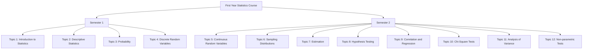

# Introduction to the Unit

See Generally [Environmental Informatics 2023](https://ryangreenup.github.io/environmental-informatics-2023/04_confidence_intervals/prediction-intervals.html)

## Mermaid Diagram

