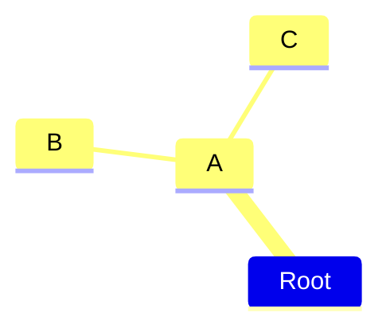
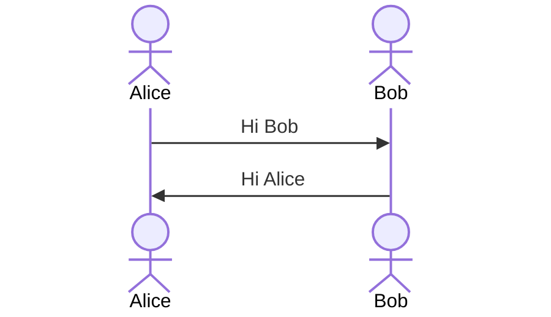
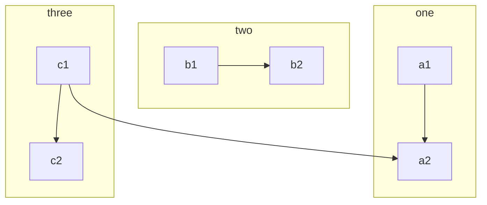
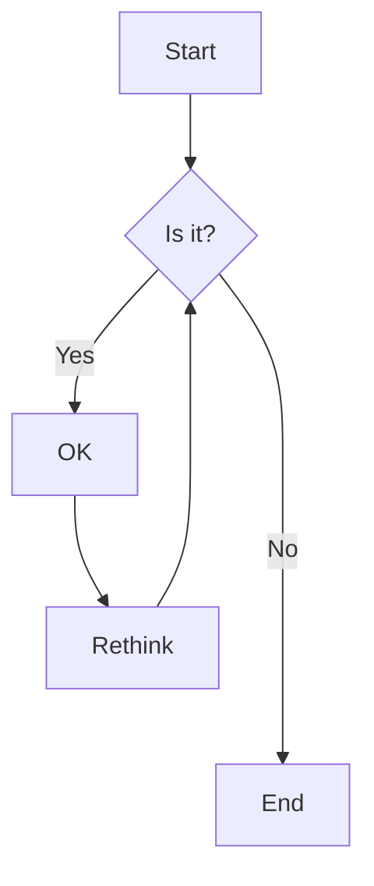
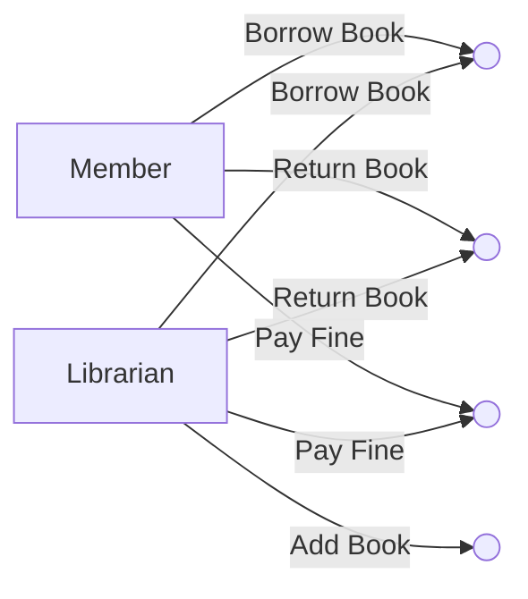

# Software Diagrams and Visualization

## Mindmaps

See Also:

- https://github.com/blitzarx1/egui_graphs
- https://pyvis.readthedocs.io/en/latest/
- [Vis-Network.js](https://github.com/visjs/vis-network)

## Use Case Diagrams

##

## Visualizing use case diagrams

## Class Diagrams

## Entity Relationships and Domain Modelling

## Sequence Diagrams

## Flowchart Diagrams
